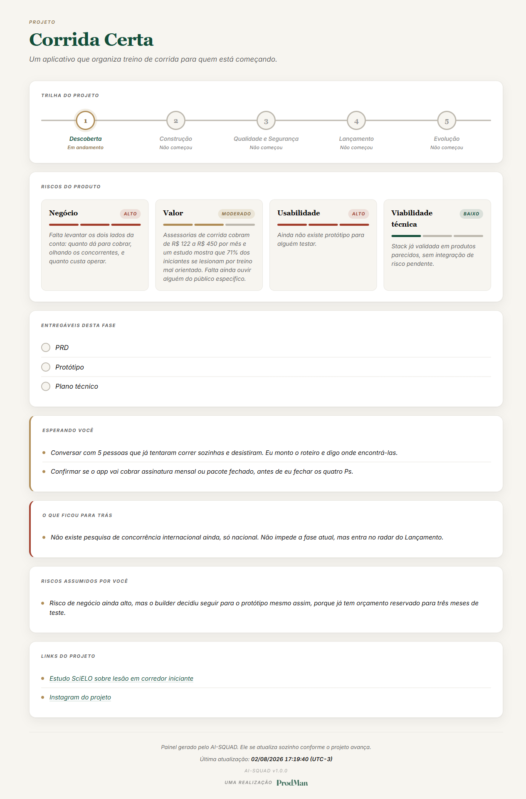

# AI-SQUAD

*Read this in [English](README.md).*

Uma squad de produto digital inteira, para quem não é da área.

Quem usa traz a ideia e decide o rumo. O AI-SQUAD faz o resto: descobre se a ideia se sustenta, constrói o produto, testa, protege, coloca no ar, monta o lançamento e continua junto depois que o produto está vivo.

Não é preciso saber o que é discovery, MVP, TDD, deploy ou eval. O sistema conduz.

## Como funciona

Antes de tudo vem o **Preparo**: instala o sistema na máquina, cria o projeto e abre o painel. Não é uma fase de construção de produto, é a instalação da ferramenta, por isso fica fora do pipeline abaixo.

A partir daí, cinco fases, em ordem, com o orquestrador conduzindo do começo ao fim.

| Fase | O que acontece | Entrega |
|------|----------------|---------|
| **1. Descoberta** | descobre se a ideia se sustenta e como ela vira produto | PRD, protótipo, plano técnico |
| **2. Construção** | constrói com teste primeiro, publica em **desenvolvimento**, instrumentado desde o início | produto funcionando em desenvolvimento, documentação técnica em dia |
| **3. Qualidade** | audita o que foi feito, faz a auditoria de segurança, e aprova | aprovação, produto ainda em desenvolvimento |
| **4. Lançamento** | monta a estratégia de go-to-market, produz o material, e **coloca o produto no ar de verdade** quando o plano de lançamento determinar | plano de go-to-market, peças, e o go-live de fato |
| **5. Evolução** | acompanha, corrige e evolui | ciclo contínuo |

A descoberta trabalha os quatro riscos de produto de Marty Cagan, e eles são vivos: todos começam altos, e vão baixando conforme o trabalho remove incerteza. A construção só é recomendada quando os quatro chegam a moderado ou baixo.

## Instalação

**macOS e Linux**

```bash
bash instalador/instalar.sh
```

**Windows**

```powershell
powershell -ExecutionPolicy Bypass -File instalador\instalar.ps1
```

O instalador copia o sistema para `~/.ai-squad`, instala as skills em `~/.claude/skills` e confere as dependências. Ele não instala nada: quem instala é a fase 0, explicando cada passo.

## Como usar

Não existe comando, palavra-chave ou skill para invocar na mão. Você só fala, em português comum, e o Claude Code reconhece sozinho que o pedido é de produto (é assim que toda skill funciona: cada uma descreve para que serve, e o Claude decide qual usar).

**Projeto novo, depois que o sistema já está instalado**: abra o Claude Code em qualquer pasta (a Área de Trabalho serve) e diga o que você quer construir: "quero criar um app que ajuda gente a organizar treino de corrida". O AI-SQUAD assume a condução a partir daí: cria a pasta do projeto, o repositório privado no GitHub, e o painel, e começa pela Descoberta.

**Retomando um projeto que já existe**: abra o Claude Code dentro da pasta desse projeto (ou numa pasta acima dela) e diga qualquer coisa, até "oi, cadê a gente parou". O sistema procura `.ai-squad/estado.json` sozinho, lê o histórico de decisões em `decisoes.md`, e retoma exatamente de onde parou, sem nunca perguntar em que fase o projeto está.

**Plugando num projeto que já existia antes do AI-SQUAD**: mesma coisa, abra o Claude Code na pasta e diga o que você quer. O sistema lê o código, o git, os arquivos de configuração e o que já estiver publicado, descobre sozinho em que estágio o produto está, e entra pela fase certa, sem refazer o que já foi feito nem pular o que ainda falta.

Em nenhum dos três casos existe uma etapa de "ativar o AI-SQUAD". A detecção automática é o próprio produto.

## O painel

Todo projeto ganha um painel próprio, em `.ai-squad/dashboard.html`. É um arquivo HTML autocontido, sem servidor, sem build, sem internet, que abre com dois cliques em qualquer navegador.

Ele existe porque o builder não tem por que confiar só na palavra do sistema sobre como o projeto está indo, e "abre o terminal e me conta" não é algo que uma pessoa não técnica consegue fazer sozinha três meses depois.

O que ele mostra, no exemplo abaixo, de um projeto fictício ("Corrida Certa") na fase de Descoberta:

- **A trilha do projeto**: as cinco fases, qual já passou, qual está em andamento, qual ainda não começou.
- **Os quatro riscos de produto** de Marty Cagan (negócio, valor, usabilidade, viabilidade técnica), cada um com o nível atual e o motivo em português simples, nunca em jargão. Todos nascem "alto" e vão caindo conforme a Descoberta levanta evidência real, exatamente como no exemplo: viabilidade técnica já caiu para baixo, valor caiu para moderado com a evidência de mercado que apareceu, negócio e usabilidade continuam altos.
- **Os entregáveis da fase atual**, o que já foi feito e o que falta.
- **O que está esperando pelo builder**: a próxima decisão que só ele pode tomar.
- **Riscos que o builder assumiu por conta própria**, quando decide seguir sem esperar a evidência baixar sozinha.
- **Quando tudo isso foi atualizado pela última vez.**



O painel se regenera sozinho a cada avanço real do projeto. O builder nunca edita esse arquivo à mão, e nunca precisa abri-lo para o sistema continuar funcionando: ele é complemento, a conversa sempre basta.

## O que tem dentro

**Skills próprias**: o orquestrador (decide em que fase entrar e nunca perde o fio), as seis fases, e o especialista de design que entra sempre que uma fatia envolve tela.

**Especialistas contidos**, em `vendor/`, copiados de propósito em vez de instalados como dependência externa (a versão que roda é a que foi testada; dependência que se atualiza sozinha muda o comportamento embaixo dos pés de quem não sabe conferir):

- **Skills For Real Engineers**, de Matt Pocock: disciplina de teste primeiro (TDD), desenho de módulo e fronteira de código, modelagem de domínio com registro de decisão de arquitetura, diagnóstico de bug difícil, revisão contra o padrão do projeto e contra o que foi pedido, prototipagem de lógica antes de construir, pesquisa técnica em fonte confiável, e resolução de conflito de merge.
- **OpenPMStrategy**: cinco bases de conhecimento e 66 ferramentas analíticas de estratégia de negócio, entre elas Mom Test (conversar com usuário sem viés de confirmação), Lean Startup (validar ideia e desenhar MVP), Hormozi (oferta, preço, garantia, modelo de receita), Growth Systems (aquisição, retenção, monetização) e Crossing the Chasm (fase de adoção, posicionamento, canal).
- **Agente de Auditoria de Segurança v3**: auditoria ofensiva completa, três fases, sete subagentes especializados, modelo de ameaça em duas camadas, modo caixa-preta, hardening de infraestrutura.

Nenhum desses três especialistas dispara sozinho como skill independente: o orquestrador lê a referência certa quando a tarefa pede aquela disciplina, aplica, e continua conduzindo. Duas cabeças dando ordem na mesma sessão não funciona, por isso só existe uma voz.

**Ferramenta**: `ferramentas/normalizar_html.py`, que converte a acentuação de qualquer HTML para escape e garante que o texto nunca chegue quebrado na tela.

## Princípios

1. Quem usa decide o produto. O sistema decide a engenharia.
2. Português claro, o menos técnico possível, sempre.
3. Ferramenta gratuita e aberta primeiro.
4. Repositório sempre privado.
5. Manutenção é automática. Evolução é aprovada.
6. Autonomia se mede por dano, não por aparência.
7. Nunca dizer pronto o que não está.

## Como a qualidade é garantida

Antes de qualquer coisa ir para produção, o produto passa por camadas independentes:

1. **Auditoria de qualidade** (fase 3): revisão do trabalho da Construção contra o que foi pedido, com a disciplina de teste primeiro de Matt Pocock.
2. **Auditoria de segurança**: ofensiva completa, três fases e sete subagentes especializados, modelo de ameaça em duas camadas, hardening de infraestrutura.
3. **Auditoria de conformidade**: quando o produto lida com dado pessoal, verifica se o que é coletado bate com o que a política de privacidade declara, e se os direitos do titular funcionam de verdade.
4. **Eval de comportamento de IA**, quando o produto tem IA dentro: conjunto de casos reais com resposta boa e ruim de exemplo, juiz automatizado calibrado contra revisão humana antes de confiar nele, e ciclo enxuto que roda o conjunto inteiro nas duas primeiras rodadas e só retesta o que quebrou dali em diante.
5. **Portão de produção**: nada vai ao ar sem as três primeiras aprovadas. Não é recomendação, é trava, registrada no estado do projeto.

O próprio AI-SQUAD segue essa disciplina: os guardrails do orquestrador (trava de produção sob pressão crescente, recusa a pular fase, resistência a injeção de instrução, entre outros) foram medidos em ciclos sucessivos de avaliação comportamental, cada correção comparada cenário a cenário contra o ciclo anterior antes de ser aceita.

## Licença

MIT. Componentes de terceiros mantêm suas licenças, listadas em [LICENSE](LICENSE).
